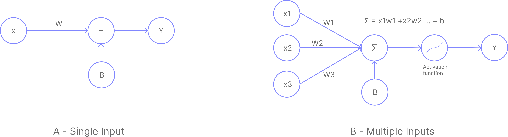
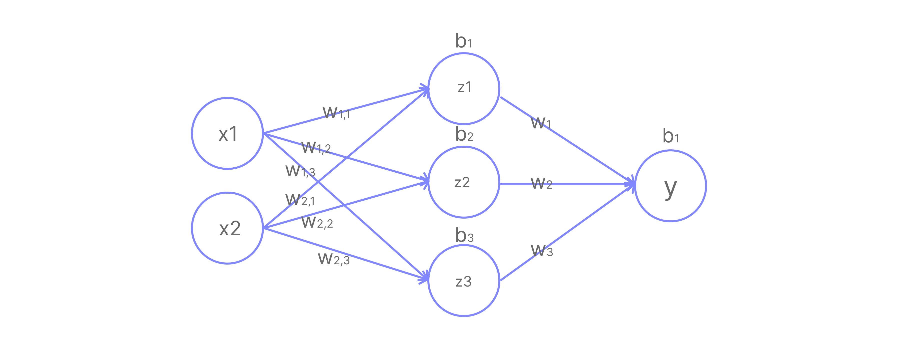

This blog is a continuation of my [**previous blog**](/blog/machine-learning-01) introducing the basic concepts of machine learning. We'll use the same ideas here with little modification to work with more general algorithms. The previous blog was about backpropagation and gradient descent.

In the previous blog we used a linear function to model the relationship between the input and output, this only worked because the data was a linear function ($y = mx + b$). However, this cannot work for more complex functions, such as polynomials, images, etc. The linear function we used to model our data was a single neuron (or a perceptron).



A- Single Input Neuron: $y = w_1x_1 + b$

B- Multi Input Neuron: $y = w_1x_1 + w_2x_2 + ... + w_nx_n + b$

Think of a single neuron as one linear equation. On its own it can only draw a straight line through data. To model something more complex, we need many of these equations working together. That is exactly what a neural network does: it stacks multiple neurons so that each one handles a piece of the problem, and together they can represent far richer relationships.

With this basic building block, we can create more complex functions by stacking multiple neurons together. This is called a neural network. The network can be represented as a graph of neurons, where each neuron is a node and the connections between neurons are the edges. They can also be stacked in layers, where each layer is a group of neurons that are connected to other neurons in the previous and/or next layers.

> A and B are the same thing, just with different number of inputs.
> They can also be referred to as a single layer neural network.



In the image above, we have a neural network with 2 input neurons, 3 hidden neurons, and 1 output neuron. The hidden layer is the layer between the input and output layers. The output layer is the layer that produces the final output $y$.

Let's digest the image above. We have 2 input neurons, $x_1$ and $x_2$. They are connected to 3 hidden neurons, $z_1$, $z_2$, and $z_3$. Each hidden neuron is connected to both input neurons and has its own weights and bias:
- $z_1$: weights $w_{11}, w_{21}$ and bias $b_1$
- $z_2$: weights $w_{12}, w_{22}$ and bias $b_2$
- $z_3$: weights $w_{13}, w_{23}$ and bias $b_3$

We can write the equations for the hidden layer as:

$$
z_1 = w_{11}x_1 + w_{21}x_2 + b_1
$$
$$
z_2 = w_{12}x_1 + w_{22}x_2 + b_2
$$
$$
z_3 = w_{13}x_1 + w_{23}x_2 + b_3
$$

Writing all three equations at once in matrix form:

$$
\begin{pmatrix} z_1 \\ z_2 \\ z_3 \end{pmatrix} = \underbrace{\begin{pmatrix} w_{11} & w_{21} \\ w_{12} & w_{22} \\ w_{13} & w_{23} \end{pmatrix}}_{3 \times 2} \underbrace{\begin{pmatrix} x_1 \\ x_2 \end{pmatrix}}_{2 \times 1} + \underbrace{\begin{pmatrix} b_1 \\ b_2 \\ b_3 \end{pmatrix}}_{3 \times 1}
$$

$$
z = Wx + B
$$

This is the same idea as $y = mx + c$, just extended to matrices. The dimensions work out as: $W$ is $3\times2$, $x$ is $2\times1$, so $Wx$ gives a $3\times1$ result, which we then add the $3\times1$ bias $B$ to.

For the output layer, we have 3 inputs $z_1, z_2, z_3$ connecting to 1 output neuron $y$, with weights $w_1, w_2, w_3$ and bias $b$:

$$
y = w_1z_1 + w_2z_2 + w_3z_3 + b
$$

In matrix form:

$$
y = \underbrace{\begin{pmatrix} w_1 & w_2 & w_3 \end{pmatrix}}_{1 \times 3} \underbrace{\begin{pmatrix} z_1 \\ z_2 \\ z_3 \end{pmatrix}}_{3 \times 1} + b
$$

#### Activation Functions

Even after stacking multiple layers, our model is fundamentally still a linear function. Substituting the hidden layer into the output layer:

$$
y = W_{out}(W_{in}x + b_{in}) + b_{out}
$$

$$
y = \underbrace{(W_{out}W_{in})}_{W_{new}}x + \underbrace{(W_{out}b_{in} + b_{out})}_{B_{new}}
$$

The whole network collapses into $y = W_{new}x + B_{new}$, just another linear function. No matter how many layers we stack, without something extra, it always reduces to a single linear transformation.

To model non-linear problems like image recognition or complex curve fitting, we must introduce non-linearity. This is the role of **Activation Functions**.

An activation function is applied to each neuron's output before passing it to the next layer, breaking the collapse and giving the network the ability to learn complex patterns.

The most common activation functions are:

1. [**Sigmoid**](https://en.wikipedia.org/wiki/Sigmoid_function): Squeezes output to the range $(0, 1)$. Used in the output layer for binary classification.
   $$\sigma(x) = \frac{1}{1 + e^{-x}}$$

2. [**ReLU (Rectified Linear Unit)**](https://en.wikipedia.org/wiki/Rectified_linear_unit): Passes positive values unchanged, zeros out negatives. The most popular choice for hidden layers.
   $$\text{ReLU}(x) = \begin{cases} x & \text{if } x > 0 \\ 0 & \text{if } x \leq 0 \end{cases}$$

3. [**Tanh (Hyperbolic Tangent)**](https://en.wikipedia.org/wiki/Hyperbolic_tangent): Squeezes output to the range $(-1, 1)$. Similar to sigmoid but zero-centered.
   $$\text{tanh}(x) = \frac{e^x - e^{-x}}{e^x + e^{-x}}$$

Applying activation function $f$ to the hidden layer output:

$$
z = f(W_{in}x + b_{in})
$$

The full network equation becomes:

$$
y = W_{out}\underbrace{f(W_{in}x + b_{in})}_{z} + b_{out}
$$

Because $f$ is non-linear, this can no longer collapse into a single $Wx + B$. The network can now approximate practically any continuous function.

> NOTE: This network can approximate a function of the form $y = F(x_1, x_2)$ where $F$ is an arbitrary function.

---

### Training the Network

We'll use ReLU as our activation function and train via backpropagation and gradient descent. Throughout this section, $y$ refers to the **network's prediction** and $\hat{y}$ refers to the **true target value** we want the network to learn. There are four steps:

1. **Forward Pass** run inputs through the network to get a prediction
2. **Calculate Loss** measure how wrong the prediction is
3. **Backward Pass** compute gradients of the loss w.r.t. each weight
4. **Update Weights** nudge weights in the direction that reduces the loss

##### Step 1 Forward Pass

**Given data:**
$$
x = \begin{pmatrix} 1 \\ 2 \end{pmatrix}, \quad \hat{y} = 3
$$

**Network equations:**
$$
z = \text{ReLU}(Wx + B), \qquad y = W_{out}z + b_{out}
$$

> This is **function composition**: $y = W_{out}\,\text{ReLU}(Wx + B) + b_{out}$

**Parameters:**

$$
W = \begin{pmatrix} 1 & 2 \\ -3 & 4 \\ 1 & -1 \end{pmatrix}_{\!3\times2}, \quad B = \begin{pmatrix} 1 \\ 2 \\ 0 \end{pmatrix}_{\!3\times1}, \quad W_{out} = \begin{pmatrix} 1 & 2 & 3 \end{pmatrix}_{\!1\times3}, \quad b_{out} = 1
$$

> $W$ is $3\times2$ because we have 3 hidden neurons each receiving 2 inputs.

**Computing the hidden layer** first apply the weights, then ReLU:

$$
Wx + B = \begin{pmatrix} 1(1) + 2(2) + 1 \\ -3(1) + 4(2) + 2 \\ 1(1) + (-1)(2) + 0 \end{pmatrix} = \begin{pmatrix} 6 \\ 7 \\ -1 \end{pmatrix}
$$

$$
z = \text{ReLU}\begin{pmatrix} 6 \\ 7 \\ -1 \end{pmatrix} = \begin{pmatrix} 6 \\ 7 \\ 0 \end{pmatrix}
$$

> $z_3$ becomes 0 because its pre-activation $(-1)$ was negative, so this neuron contributes nothing to the output.

**Computing the output:**

$$
y = W_{out}z + b_{out} = \begin{pmatrix} 1 & 2 & 3 \end{pmatrix}\begin{pmatrix} 6 \\ 7 \\ 0 \end{pmatrix} + 1 = 6 + 14 + 0 + 1 = \mathbf{21}
$$

##### Step 2 Calculate Loss

We use **Mean Squared Error (MSE)** to measure how far our prediction ($y = 21$) is from the target ($\hat{y} = 3$):

$$
\text{MSE} = \frac{1}{2n}\sum_{i=1}^{n}(y_i - \hat{y}_i)^2
$$

With a single sample ($n=1$):

$$
\text{MSE}(3,\; 21) = \frac{1}{2}(3 - 21)^2 = \frac{1}{2}(-18)^2 = \frac{324}{2} = \mathbf{162}
$$

##### Step 3 Backward Pass

We work **backwards** through the network, computing how much each weight contributed to the loss.

The chain rule lets us do this by multiplying together a chain of small derivatives, one per layer. Before we apply it, we first compute each individual piece we will need.

**Gradient of the loss w.r.t. the prediction $y$:**

$$
\frac{\partial L}{\partial y} = \frac{1}{n}\sum_{i=1}^{n}(y_i - \hat{y}_i) = y - \hat{y} = 21 - 3 = 18
$$

Before we can apply the chain rule, we need a few individual partial derivatives first, think of them as the building blocks that will be multiplied together in the next section.

**Output layer gradients** from $y = W_{out}z + b_{out}$:

$$
\frac{\partial y}{\partial W_{out}} = z^\top = \begin{pmatrix} 6 & 7 & 0 \end{pmatrix}
$$

> Since $y = W_{out}z + b_{out}$, differentiating w.r.t. $W_{out}$ gives $z^\top$, not $W_{out}$ itself. The gradient scales with what the weights *received as input*, not their current values.

$$
\frac{\partial y}{\partial b_{out}} = 1 \qquad \frac{\partial y}{\partial z} = W_{out} = \begin{pmatrix} 1 & 2 & 3 \end{pmatrix}
$$

**Hidden layer gradients** from $z = \text{ReLU}(W_{in}x + B)$:

The ReLU derivative acts as a gate: it passes the gradient through where the neuron was active, and blocks it where the neuron was inactive.

$$
\frac{\partial\,\text{ReLU}(u)}{\partial u} = \begin{cases} 1 & \text{if } u > 0 \\ 0 & \text{if } u \leq 0 \end{cases}
$$

For our pre-activations $(6,\, 7,\, -1)$, the gate values are:

$$
\text{ReLU}'\begin{pmatrix} 6 \\ 7 \\ -1 \end{pmatrix} = \begin{pmatrix} 1 \\ 1 \\ 0 \end{pmatrix}
$$

The gradient w.r.t. $W_{in}$ and $b_{in}$ (before the ReLU):

$$
\frac{\partial(W_{in}x + B)}{\partial W_{in}} = x = \begin{pmatrix} 1 \\ 2 \end{pmatrix}, \qquad \frac{\partial(W_{in}x + B)}{\partial b_{in}} = 1
$$

###### Chain Rule

Combining the above using the chain rule:

$$
\frac{\partial L}{\partial W_{out}} = \frac{\partial L}{\partial y} \cdot \frac{\partial y}{\partial W_{out}} = 18 \cdot z^\top = \begin{pmatrix} 108 & 126 & 0 \end{pmatrix}
$$

$$
\frac{\partial L}{\partial b_{out}} = \frac{\partial L}{\partial y} \cdot \frac{\partial y}{\partial b_{out}} = 18 \cdot 1 = 18
$$

$$
\frac{\partial L}{\partial z} = \frac{\partial L}{\partial y} \cdot \frac{\partial y}{\partial z} = 18 \cdot W_{out} = \begin{pmatrix} 18 & 36 & 54 \end{pmatrix}
$$

For the hidden layer, the gradient must also pass through the ReLU gate:

$$
\frac{\partial L}{\partial W_{in}} = \frac{\partial L}{\partial z} \cdot \underbrace{\text{ReLU}'(W_{in}x + B)}_{\text{ReLU gate}} \cdot x^\top
$$

$$
\frac{\partial L}{\partial b_{in}} = \frac{\partial L}{\partial z} \cdot \underbrace{\text{ReLU}'(W_{in}x + B)}_{\text{ReLU gate}}
$$

> Because $z_3$'s pre-activation was $-1$, its ReLU gate is 0, so **no gradient flows back to the third row of $W_{in}$**. Those weights receive no update at all for this sample. This is known as the "dying ReLU" problem.

##### Step 4: Update Weights

With **Gradient Descent**, we update each parameter by subtracting a fraction of its gradient, controlled by the learning rate $\eta$:

$$
\theta_{new} = \theta_{old} - \eta \cdot \frac{\partial L}{\partial \theta}
$$

With $\eta = 0.01$:

$$
W_{in, new} = W_{in, old} - \eta \cdot \frac{\partial L}{\partial W_{in, old}} \\ 

W_{in, new} = \begin{pmatrix} 1 & 2 \\ -3 & 4 \\ 1 & -1 \end{pmatrix} - 0.01 \cdot \begin{pmatrix} 18 & 36 \\ 36 & 72 \\ 0 & 0 \end{pmatrix} = \begin{pmatrix} 0.82 & 1.64 \\ -3.36 & 3.28 \\ 1 & -1 \end{pmatrix}
$$

$$
b_{in, new} = b_{in, old} - \eta \cdot \frac{\partial L}{\partial b_{in, old}} \\ 

b_{in, new} = \begin{pmatrix} 1 \\ 2 \\ 0 \end{pmatrix} - 0.01 \cdot \begin{pmatrix} 18 \\ 36 \\ 0 \end{pmatrix} = \begin{pmatrix} 0.82 \\ 1.64 \\ 0 \end{pmatrix}
$$

$$
W_{out, new} = W_{out, old} - \eta \cdot \frac{\partial L}{\partial W_{out, old}} \\

W_{out, new} = \begin{pmatrix} 1 & 2 & 3 \end{pmatrix} - 0.01 \cdot \begin{pmatrix} 108 & 126 & 0 \end{pmatrix} = \begin{pmatrix} -0.08 & 0.74 & 3 \end{pmatrix}
$$

$$
b_{out, new} = b_{out, old} - \eta \cdot \frac{\partial L}{\partial b_{out, old}} \\

b_{out, new} = 1 - 0.01 \cdot 18 = 0.82
$$

Our network now becomes:

$$
\begin{pmatrix} z_1 \\ z_2 \\ z_3 \end{pmatrix} = \text{ReLU} \left( \begin{pmatrix} 0.82 & 1.64 \\ -3.36 & 3.28 \\ 1 & -1 \end{pmatrix} \begin{pmatrix} x_1 \\ x_2 \end{pmatrix} + \begin{pmatrix} 0.82 \\ 1.64 \\ 0 \end{pmatrix} \right)
$$

$$
y = \begin{pmatrix} -0.08 & 0.74 & 3 \end{pmatrix} \begin{pmatrix} z_1 \\ z_2 \\ z_3 \end{pmatrix} + 0.82
$$

After one update, the network is slightly better at predicting 3 for input $(1, 2)$. Repeating this many times across many samples gradually trains the network to map inputs to correct outputs.

### Automating the Process

Let's write some code to help us train the model quickly instead of doing it by hand. I will use `numpy` to make it easy for beginners to understand, but you can go ahead and implement it in your favorite framework, either `pytorch` or `tensorflow`.

```py
import numpy as np

# Initialize weights and biases
# we used random values in the previous blog
W_in = np.array([[1, 2], 
                 [-3, 4], 
                 [1, -1]])
b_in = np.array([1, 2, 0])
W_out = np.array([[1, 2, 3]])
b_out = 1

# Input and target
x = np.array([1, 2])
y_target = 3
learning_rate = 0.01

# Training Loop
for epoch in range(10):
    # Forward pass
    u = np.dot(W_in, x) + b_in  
    z = np.maximum(0, u)        
    y = np.dot(W_out, z) + b_out 

    # Calculate Loss
    loss = 0.5 * (y - y_target)**2

    # Backward Pass
    dL_dy = (y - y_target)

    # Output layer gradients
    dL_dW_out = np.outer(dL_dy, z)
    dL_db_out = dL_dy

    # Hidden layer gradients
    dL_dz = np.dot(dL_dy.reshape(-1, 1), W_out)
    dL_du = dL_dz * (u > 0)
    dL_dW_in = np.dot(dL_du.T, x.reshape(1, -1))
    dL_db_in = dL_du.flatten()

    # Update parameters
    W_in = W_in - learning_rate * dL_dW_in
    b_in = b_in - learning_rate * dL_db_in
    W_out = W_out - learning_rate * dL_dW_out
    b_out = b_out - learning_rate * dL_db_out

    print(f"Epoch {epoch}: Loss = {loss[0]:.4f}, Prediction = {y[0]:.4f}")
```

```bash
Epoch 0: Loss = 162.0000, Prediction = 21.0000
Epoch 1: Loss = 0.5080, Prediction = 4.0080
Epoch 2: Loss = 0.1182, Prediction = 3.4862
Epoch 3: Loss = 0.0282, Prediction = 3.2376
Epoch 4: Loss = 0.0068, Prediction = 3.1167
Epoch 5: Loss = 0.0017, Prediction = 3.0575
Epoch 6: Loss = 0.0004, Prediction = 3.0283
Epoch 7: Loss = 0.0001, Prediction = 3.0140
Epoch 8: Loss = 0.0000, Prediction = 3.0069
Epoch 9: Loss = 0.0000, Prediction = 3.0034
```

We have seen a complex network evolve to learn the function that maps $(1, 2)$ to $3$. This kind of network is called a **Multi-Layer Perceptron (MLP)** or **Feed Forward Neural Network (FFNN)**. The general formula for any MLP is:

$$
y = \sigma(F_n(\sigma(F_{n-1}(\sigma(F_{n-2}(\cdots \sigma(F_1(x))\cdots))))))
$$

$$
F(x) = Wx + B \qquad \sigma(x) = \text{Activation function}
$$

Reading this from the inside out: $F_1$ is the first layer, it takes the raw input $x$ and applies $W_1x + B_1$. Then $\sigma$ applies the activation function. The result is fed into $F_2$, which does the same thing, and so on up to layer $F_n$, the output layer. Each subscript (1, 2, ..., $n$) just labels which layer we are on. Our worked example had $n = 2$: one hidden layer and one output layer.

> NOTE: You can use any activation function you want, usually based on the problem you are solving.

---

### Summary

Here is everything we covered in this blog:

**Neural Networks** are built by stacking multiple neurons into layers. Each layer applies a linear transformation $z = Wx + B$, where $W$ is a weight matrix and $B$ is a bias vector. The number of rows in $W$ equals the number of neurons in that layer, and the number of columns equals the number of inputs it receives.

**Activation Functions** like ReLU, Sigmoid, and Tanh introduce non-linearity between layers. Without them, the entire network collapses into a single linear function $y = W_{new}x + B_{new}$ regardless of how many layers are stacked.

**Forward Pass** computes the prediction by passing the input through each layer in sequence: multiply by weights, add bias, apply activation, and repeat until the output layer.

**Loss Function** measures how wrong the prediction is. We used Mean Squared Error:
$$
\text{MSE} = \frac{1}{2n}\sum_{i=1}^{n}(y_i - \hat{y}_i)^2
$$

**Backward Pass** applies the chain rule to compute the gradient of the loss with respect to every weight and bias, working from the output layer back to the input. The ReLU derivative acts as a gate, passing gradients through active neurons and blocking them for inactive ones (pre-activation $\leq 0$). A neuron that is blocked receives no weight update for that sample, which is called the dying ReLU problem.

**Gradient Descent** updates each parameter by stepping in the direction that reduces the loss:
$$
\theta_{new} = \theta_{old} - \eta \cdot \frac{\partial L}{\partial \theta}
$$

**MLP (Multi-Layer Perceptron)** is the general name for this architecture. Its formula is:
$$
y = \sigma(F_n(\sigma(F_{n-1}(\cdots \sigma(F_1(x))\cdots))))
$$
where $F(x) = Wx + B$ and $\sigma$ is any activation function.

Repeating these four steps over many samples and many epochs gradually drives the loss toward zero, teaching the network to correctly map inputs to outputs.