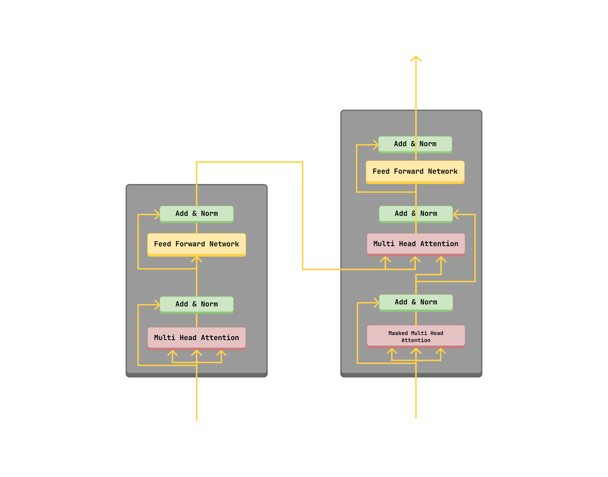
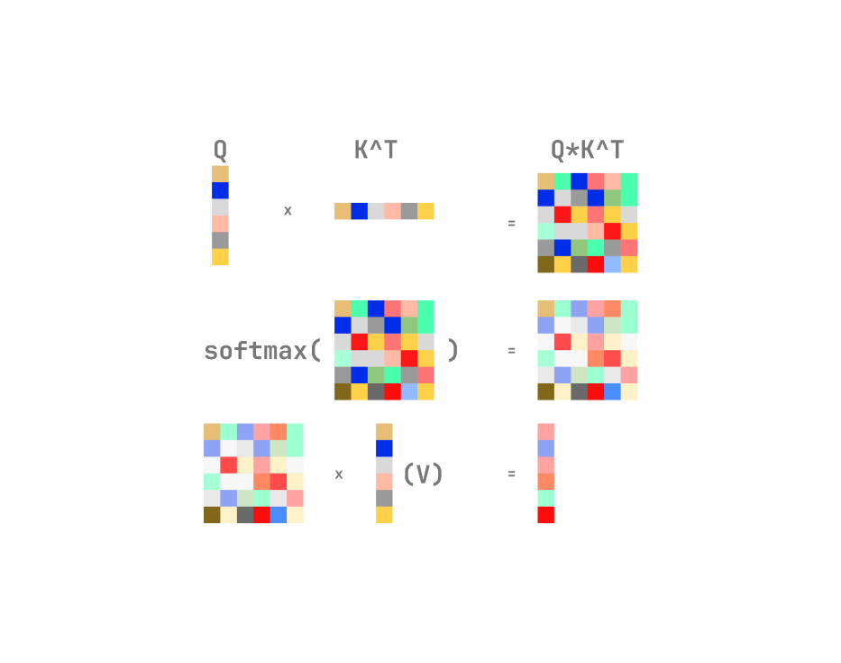
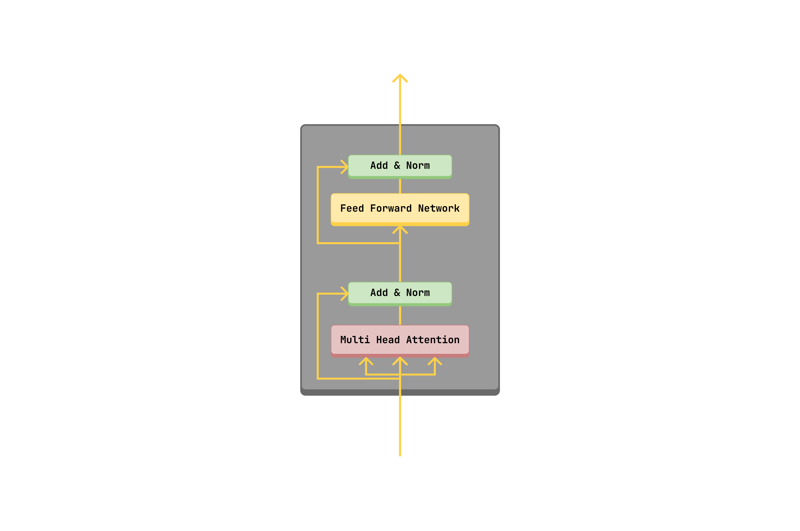

This paper gave birth to the **Transformer architecture**, which has become the foundation for most of the state-of-the-art models in NLP, Computer Vision, and other fields.

### Model Architecture

Transformer model architecture

The transformer model is composed of an encoder and a decoder. This alows for sequence to sequence modeling, such as translation which was the main focus of the paper. Previously, 
Recurrent Neural Networks (RNNs) were used for sequence modeling, but they had limitations such as the vanishing gradient problem and the inability to capture long-range dependencies. 

#### Self-Attention
The transformer also introduced the concept of **self-attention**, which allows the model to weigh the importance of different words in the input sequence when processing a particular word. This also gives the model a global view of it's input **query** and **key** vectors. 

<!-- Attention formula -->

$$ 
\text{Attention}(Q, K, V) = \text{softmax}\left(\frac{QK^T}{\sqrt{d_k}}\right)V 
$$

Attention calculates the **similarity** between the **query (Q)** and **key (K)** vectors using the **scaled dot-product**, then uses the **softmax** function to get the **attention weights**, and finally multiplies the **attention weights** by the **value (V)** vectors to get the **output**. This in effect allows the model to focus on the most relevant parts of the input sequence when processing a particular word.

  An illustration of how self-attention works. Each colored vector is a `word/token/patch/pixel` depending on the model.

#### Multi-Head Attention

Multi-head attention is a mechanism that allows the model to attend to different parts of the input sequence at the same time. It is a way to parallelize the attention mechanism and allow the model to capture different types of relationships between words in the input sequence.

#### Self-Attention vs Cross-Attention

In self-attention, the **query**, **key**, and **value** vectors are all derived from the same input sequence. Where as in cross-attention, the **query** vector is derived from one sequence, and the **key** and **value** vectors are derived from another sequence. For example, in a translation task, the **query** vector would be derived from the target language sequence, and the **key** and **value** vectors would be derived from the source language sequence.

#### The Encoder

The encoder is composed of a stack of **N** identical layers. Each layer has two sub-layers. The first sub-layer is a **multi-head self-attention** mechanism with layer normalization and a residual connection. The second sub-layer is a **position-wise feed-forward** network with layer normalization and a residual connection.

The encoder can be as a standalone model, such as in **Bidirectional Encoder Representations from Transformers (BERT)**, or **Vision Transformer (ViT)**.
In essence the encoder create a **contextualized representation**/**latent representation** of the input sequence. 

#### The Decoder

The decoder is composed of a stack of **N** identical layers. Each layer has three sub-layers. The first sub-layer is a **masked multi-head self-attention** mechanism with layer normalization and a residual connection. The second sub-layer is a **multi-head cross-attention** mechanism with layer normalization and a residual connection. The third sub-layer is a **position-wise feed-forward** network with layer normalization and a residual connection.

The decoder can be as a standalone model, such as in **Generative Pre-trained Transformer (GPT)**. 

### Conclusion (Thoughts)

The paper is a landmark in the field of deep learning, and it is a must-read for anyone interested in NLP, computer vision or Machine Learning in general. The transformer architecture has enabled the development of foundation models for a lot of domains, such as NLP, computer vision, Robotics, and many more.
I have been able to replicate the model using PyTorch (for translating English to Twi).
Check out the [`code`](https://github.com/etornam45/model_translate) on GitHub.

Thank you for reading.