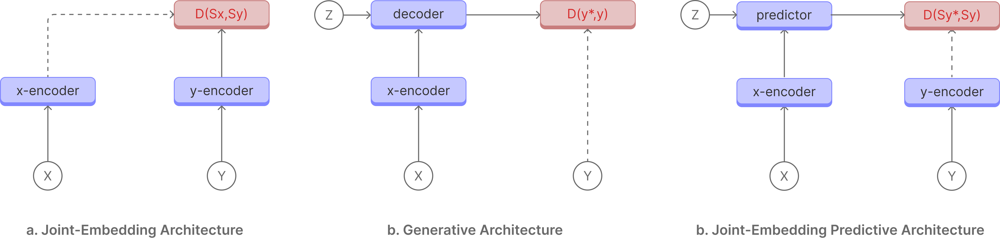

### Self-Supervised Learning from Images with a Joint-Embedding Predictive Architecture

Self-supervised learning is an approach to training deep neural networks where the model learns representations of relationships between data points. This is in contrast to supervised learning, where the model is trained on labelled data. Joint embedding predictive architecture (JEPA) is a self-supervised learning approach that uses a joint embedding space to learn the relationship between data points by predicting the future state or relationship in input data. 

 
 

 
 

1.  #### Joint-Embedding Architecture
    The Joint-Embedding Architecture is a staight forward arcitecture where the models is trained to create similar representations given views of the same input data, such as masking out a part of the data and predicting the representation of the masked part or cropping out a part of the data and predicting the representation of the cropped part. DINO, MoCo, and SwAV are examples of Joint-Embedding Architecture. 

2.  #### Generative Architecture
    The Generative Architecture is a more complex arcitecture where the model is tasked to reconstruct the input data from a compressed representation. This is in contrast to Joint-Embedding Architecture, where the model is tasked to create similar representations given views of the same input data. Generative models such as GPT, MAE, and BEiT are examples of Generative Architecture.

3.  #### Joint-Embedding Predictive Architecture
    The Joint-Embedding Predictive Architecture works in the representation state where the model is tasked to predict the future state or relationship in input data. This is in contrast to Joint-Embedding Architecture, where the model is tasked to create similar representations given views of the same input data. Working in the representation space allows the model to focus on learning important features of the input data while ignoring noise and irrelevant details.

### Method

I-JEPA is a self-supervised learning approach that uses a joint embedding space to learn the relationship between data points by predicting the masked patches in images. I-JEPA  masks out patches in images and predicts the masked patches in images. It is made up of an context encoder(x), target encoder(y), and a predictor(z). The context encoder(x) and target encoder(y) are used to generate the representation of the input data. The predictor(z) is used to predict the representation of the masked patches in images. 

#### What makes I-JEPA different?

I-JEPA works in the `representation/latent` space, this allows the model to focus on creating abstract representations that model relationtionships rather than **pixel** or **token** level details. 

#### Conclusion
I-JEPA performs better that sota models on different benchmarks while using less compute resources. I am personally optimistic about the JEPA achitecture and world models and I-JEPA has proven that world modesl are possible through JEPA. 

Thank you for reading